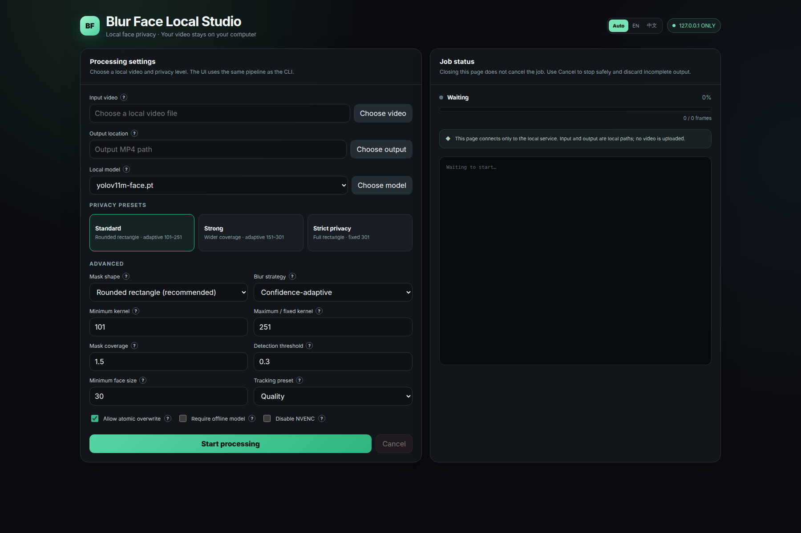

# Blur Face Local

**带本地网页 UI 的视频人脸隐私处理工作台。**

[English README](README.md) · [1.0.0 版本说明](CHANGELOG.md)

Blur Face 在本机检测、追踪并遮挡视频中的人脸，不会把视频帧发送到远程服务。
1.0 正式版将本地网页 UI 作为最简单的使用方式，同时保留完整 CLI，方便自动化
和高级工作流。



## 1.0 提供什么

- 完整的本地网页 UI，以及系统原生的输入、输出和模型文件选择器。
- 根据浏览器首选语言自动选择英文或中文，也可以使用
  `Auto / EN / 中文` 手动切换。
- 自动发现本地模型：配置的 `models` 目录中所有 `.pt` 文件都会显示在 UI。
- 每一个处理参数都有双语 `?` 说明。
- 标准、强力、严格隐私三个预设，并可继续调整全部高级参数。
- 实时帧进度、日志、完成状态和安全取消。
- 保守的多人追踪，以及检测短暂中断时的光流辅助。
- 按置信度自适应的模糊强度、较强的隐私默认值和三种遮挡形状。
- 原子输出替换：不完整的编码不会覆盖已有成品。
- NVIDIA CUDA 检测和可选 NVENC 编码，并提供经过验证的回退路径。

## 快速开始

需要 Python 3.10 或更高版本。

### Windows

```powershell
git clone https://github.com/billcshi/blur-face.git
cd blur-face
.\init.bat
.\start-ui.bat
```

### Linux / macOS

```bash
git clone https://github.com/billcshi/blur-face.git
cd blur-face
chmod +x init.sh start-ui.sh
./init.sh
./start-ui.sh
```

安装脚本会创建隔离的 `.venv`、安装锁定依赖、以 editable 模式安装项目，并下载
经过校验的正式模型。此后普通的 `git pull` 会立即更新启动脚本使用的代码。

## 本地工作台

`start-ui.bat` 或 `start-ui.sh` 会启动只监听 `127.0.0.1` 的小型服务，并在
浏览器中打开带随机 token 保护的页面。

UI 提供：

- 系统原生本地文件选择；浏览器不会上传视频；
- 自动列出 `models/` 和 `BLUR_FACE_MODEL_DIR` 中的模型；
- 可选择任意其他本地 `.pt` 模型；
- 浏览器语言自动识别，以及会在本地保存的手动语言选择；
- 每个选项都带有支持鼠标悬停和键盘聚焦的双语说明；
- 隐私预设，以及遮挡、模糊、阈值、尺寸、追踪、覆盖、离线和编码控制；
- 当前帧进度、处理日志、完成状态和安全取消。

关闭浏览器页面不会取消正在运行的任务。请使用“取消”按钮安全停止子进程并
丢弃不完整的临时输出。

如果 8765 端口被占用：

```powershell
.\start-ui.bat --port 8766
```

## 隐私边界

- 视频解码、检测、追踪、遮挡和编码都在本机完成。
- 逐帧处理循环不会联网，也不会上传视频。
- 如果选择的模型缺失，模型初始化可能在解码第一帧之前下载已知模型。
- 在 UI 启用“严格离线模型”，或传入 `--offline`，可在模型缺失时直接失败。
- UI 只监听本机回环地址，API 需要随机 token，页面没有上传控件，也不加载远程资源。
- 任何自动检测器都无法保证完全不漏检。发布敏感视频前必须人工检查成品。

## 隐私预设和遮挡形状

| 预设 | 形状 | 模糊 | 覆盖范围 |
|---|---|---|---:|
| 标准 | 圆角矩形 | 自适应 101–251 | 1.5× |
| 强力 | 圆角矩形 | 自适应 151–301 | 1.65× |
| 严格隐私 | 完整矩形 | 固定 301 | 1.5× |

默认圆角矩形只会在检测框外的扩张区域形成圆角，模型检测到的完整矩形始终保持
不透明。如果扩张区域接触画面边界，遮挡会退化为完整矩形，而不会切入人脸。

- `rounded-rect`：在覆盖安全和视觉面积之间取得平衡的默认值。
- `rectangle`：最严格的完整扩张矩形。
- `ellipse`：保留旧版外观，对矩形四角的覆盖较弱。

当前原始检测框和平滑/预测追踪区域会分别渲染，因此平滑不会替换或滞后于当前
检测结果。最小人脸尺寸默认为 30 像素，避免把极小噪声变成明显遮挡块。

## GPU 行为

项目有三条相互独立的加速路径：

1. **检测：** YOLO 在可用时使用 PyTorch CUDA，并显示 GPU、PyTorch 和 CUDA
   runtime 版本。
2. **遮挡渲染：** 普通 OpenCV wheel 在 CPU 上合成模糊；看到 `Render: CPU`
   不代表人脸检测也在 CPU 上。
3. **编码：** 只有 FFmpeg 通过真实运行探测时才使用 NVENC，否则回退到 `libx264`。

Windows 和 Linux 的 `init` 会检查 `nvidia-smi`。NVIDIA 机器会安装经过测试的
PyTorch 2.12.1 CUDA 12.6 wheel，并用 `torch.cuda.is_available()` 验证。
只有明确需要纯 CPU 安装时，才应在安装前设置 `BLUR_FACE_CPU_ONLY=1`。

## CLI

UI 和 CLI 使用同一条经过校验的处理管线。

```powershell
# Windows
.\.venv\Scripts\blur-face.exe input.mov -o output.mp4 --overwrite

# 选择本地模型并使用严格矩形
.\.venv\Scripts\blur-face.exe input.mov -o output.mp4 `
  --model .\models\yolov11m-face.pt `
  --mask-shape rectangle `
  --blur-strategy fixed `
  --blur-kernel 301 `
  --overwrite
```

```bash
# Linux / macOS
.venv/bin/blur-face input.mov -o output.mp4 --overwrite

# 模型初始化也必须严格离线
.venv/bin/blur-face input.mov -o output.mp4 --offline
```

关键默认值：

| 参数 | 默认值 | 作用 |
|---|---:|---|
| `--model` | `yolov11m-face.pt` | 本地路径或可下载模型名 |
| `--thresh` | `0.3` | 检测置信度阈值 |
| `--mask-shape` | `rounded-rect` | 遮挡几何形状 |
| `--mask-scale` | `1.5` | 追踪区域外扩比例 |
| `--blur-strategy` | `adaptive` | 自适应或固定模糊 |
| `--blur-kernel-min` | `101` | 自适应最小模糊 Kernel |
| `--blur-kernel` | `251` | 自适应最大或固定 Kernel |
| `--min-face-size` | `30` | 最小检测宽度和高度 |
| `--lost-buffer` | `180` | 追踪保留寿命上限 |
| `--preset` | `quality` | 追踪/光流计算策略 |
| `--offline` | 关闭 | 禁止缺失模型下载 |

运行 `blur-face --help` 查看完整且权威的参数列表。

Track ID 是临时运动轨迹，不是生物身份，因此排除追踪 ID 具有隐私风险。
`--exclude-ids` 必须同时使用 `--allow-unsafe-exclusions` 明确接受风险。

## 安全输出

编码首先写入目标路径旁边的隐藏临时文件。只有 FFmpeg 正常退出且成品非空时，
才会替换请求的输出路径。失败或中断会删除临时输出并返回非零状态。已有文件必须
显式使用 `--overwrite`，即使允许覆盖，旧文件也会保留到新文件完整生成之后。

## 模型和联网行为

安装器通过固定 SHA-256 校验和原子下载把正式模型写入 `models/`。模型查找顺序：

1. 显式路径；
2. `BLUR_FACE_MODEL_DIR`；
3. 当前项目的 `models/`；
4. 已安装包对应项目的 `models/`。

UI 会列出这些模型目录中的本地 `.pt` 文件。除非启用离线模式，否则已知的缺失
正式模型可能在初始化阶段下载。视频处理开始后不会再下载模型。

## 更新与卸载

```powershell
# 更新
git pull

# 删除环境和生成缓存，保留模型与用户文件
.\uninstall.bat

# 同时删除模型
.\uninstall.bat --remove-models
```

```bash
git pull
./uninstall.sh
./uninstall.sh --remove-models
```

## 架构

```text
本地 UI / CLI → AppConfig 校验 → 模型初始化
                                      ↓
视频 → 检测器 → 全局追踪 + 光流 → 隐私覆盖区域
                                         ↓
                                     遮挡渲染
                                         ↓
                              原子 FFmpeg 编码 → 成品
```

代码按配置、模型存储、视频输入、检测、追踪、渲染、编码、管线所有权、控制台兼容
和本地 UI 进程控制拆分为独立模块。

## 开发与 CI

```bash
python -m unittest discover -s tests -v
python -m compileall -q blurface tests scripts
```

GitHub Actions 在 Windows 和 Ubuntu 上测试 Python 3.10 与 3.12。测试覆盖隐私
遮挡不变量、追踪行为、模型查找、本地 UI 请求校验、Windows 控制台兼容、安装脚本
和编码器原子失败处理。

## License

MIT © 2025 Jiechang Shi
